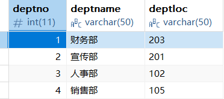
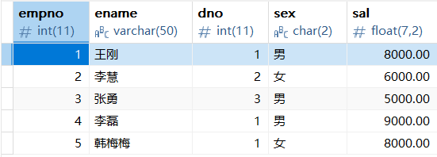

# MySQL笔记 - Bairu

- [MySQL笔记 - Bairu](#mysql笔记---bairu)
  - [一、MySQL数据库操作](#一mysql数据库操作)
    - [1. 增](#1-增)
    - [2. 查](#2-查)
    - [3. 改](#3-改)
    - [4. 删](#4-删)
    - [5. 视图](#5-视图)

## 一、MySQL数据库操作

- **示例表一：tab_dept**  

    

- **示例表二：tab_emp**  

    

### 1. 增

  - 向表中插入数据

      ```sql
      /*
        向表中插入一条数据
        INSERT INTO 表名(字段, 字段, ...) VALUES(值, '值', ...);
        如果值是字符型, 必须在值两端加单引号
        最后要执行提交语句COMMIT
      */
      INSERT INTO 
          tab_dept(deptno, deptname, deptloc) 
          VALUES(3, '人事部', '102');
      COMMIT;

      /*具有自动递增属性的字段可以不指定插入值*/
      INSERT INTO 
          tab_dept(deptname, deptloc) 
          VALUES('销售部', '105');
      COMMIT;
      ```

### 2. 查

- 查询表中数据

    ```sql
    /*
      查询表中所有列的数据
      SELECT * FROM 表名;
    */
    SELECT * FROM tab_dept;

    /*
      查询表中任意几列数据
      SELECT 字段, 字段, ... FROM 表名;
    */
    SELECT 
        deptno
        ,deptname 
    FROM 
        tab_dept;

    /*
      给字段建立别名（仅当前sql文有效），使命名简短易于操作
      SELECT 字段1 AS 别名1, 字段2 AS 别名2, ... FROM 表名;
    */
    SELECT 
        deptno AS dnum
        ,deptname AS dname 
    FROM 
        tab_dept;
    ```

- 条件查询

    ```sql
    /*
      等值条件查询
      SELECT 字段, 字段, ... FROM 表名 WHERE 字段 = 值;
    */
    SELECT 
        deptno,deptname 
    FROM 
        tab_dept 
    WHERE 
        deptno = 1;

    /*
      不等值条件查询
      SELECT 字段, 字段, ... FROM 表名 WHERE 字段 不等值条件符号 值;
    */
    SELECT 
        deptno
        ,deptname
        ,deptloc 
    FROM 
        tab_dept 
    WHERE 
        deptno != 1;

    /*
      包含边界值的区间范围内条件查询
      SELECT 字段, 字段, ... FROM 表名 WHERE 字段 BETWEEN 小值 AND 大值;
    */
    SELECT 
        deptno
        ,deptname
        ,deptloc 
    FROM 
        tab_dept 
    WHERE 
        deptno BETWEEN 2 AND 4;

    /*
      不包含边界值的区间范围内条件查询(与条件查询)
      SELECT 字段, 字段, ... FROM 表名 WHERE 字段 > 小值 AND 字段 < 大值;
    */
    SELECT 
        deptno
        ,deptname
        ,deptloc 
    FROM 
        tab_dept 
    WHERE 
        deptno > 2 AND deptno < 4;

    /*
      或条件查询
      SELECT 字段, 字段, ... FROM 表名 WHERE 字段 > 小值 OR 字段 < 大值;
    */
    SELECT 
        deptno
        ,deptname
        ,deptloc 
    FROM 
        tab_dept 
    WHERE 
        deptno < 1 OR deptno > 3;

    /*
      在集合中判断任意相等的条件
      SELECT 字段, 字段, ... FROM 表名 WHERE 字段 IN (值, 值);
    */
    SELECT 
        deptno
        ,deptname
        ,deptloc 
    FROM 
        tab_dept 
    WHERE 
        deptno IN (1,2);

    /*
      查询以某字符起始的内容
      SELECT 字段, 字段, ... FROM 表名 WHERE 字段 LIKE '起始字符%';
      % 代表0个或多个字符
    */
    SELECT 
        deptno
        ,deptname 
    FROM 
        tab_dept 
    WHERE 
        deptname LIKE '销%';

    /*
      占位通配符查询
      SELECT 字段, 字段, ... FROM 表名 WHERE 字段 LIKE '_第二个字符%';
      _ 代表一个字符
    */
    SELECT 
        deptno
        ,deptname 
    FROM 
        tab_dept 
    WHERE 
        deptname LIKE '_传%';

    /*
      查询以某字符结尾的内容
      SELECT 字段, 字段, ... FROM 表名 WHERE 字段 LIKE '%结尾字符';
    */
    SELECT 
        deptno
        ,deptname 
    FROM 
        tab_dept 
    WHERE 
        deptname LIKE '%部';

    /*
      查询包含某字符的内容
      SELECT 字段, 字段, ... FROM 表名 WHERE 字段 LIKE '%字符%';
    */
    SELECT 
        deptno
        ,deptname 
    FROM 
        tab_dept 
    WHERE 
        deptname LIKE '%事%';

    /*
      查询不包含某字符的内容
      SELECT 字段, 字段, ... FROM 表名 WHERE 字段 NOT LIKE '%字符%';
    */
    SELECT 
        deptno
        ,deptname 
    FROM 
        tab_dept 
    WHERE 
        deptname NOT LIKE '%事%';
    ```

- 聚合函数查询

    ```sql
    /* 聚合函数: COUNT MAX MIN AVG SUM */
    
    /*
      COUNT: 统计表中行数
      COUNT(DISTINCT expr,[expr...])
    */
    SELECT COUNT(deptno) FROM tab_dept;
    
    /*
      MAX: 查找最大值
      MAX(expr)
    */
    SELECT MAX(deptno) FROM tab_dept;
    
    /*
      MAX: 查找最小值
      MIN(expr)
    */
    SELECT MIN(deptno) FROM tab_dept;
    
    /*
      AVG: 求平均值
      AVG([DISTINCT] expr)
    */
    SELECT AVG(deptno) FROM tab_dept;
    
    /*
      AVG: 求和
      SUM(expr)
    */
    SELECT SUM(deptno) FROM tab_dept;
    ```

- 分组查询

    ```sql
    /*
      分组查询: GROUP BY
      当SELECT语句中同时出现聚合函数和普通字段，必须将普通字段分组(GROUP BY)
      SELECT 字段1, 聚合函数(字段2) [as 聚合函数别名] FROM 表名 WHERE 条件 GROUP BY 字段1;
    */
    SELECT 
        sex
        ,COUNT(empno) AS rn 
    FROM 
        tab_emp 
    WHERE 
        dno = 1 
    GROUP BY 
        sex;

    /*
      分组后条件查询: HAVING
      SELECT 字段1, 聚合函数(字段2) [as 聚合函数别名] FROM 表名 WHERE 分组前的条件 GROUP BY 字段1 HAVING 分组后的条件;
    */
    SELECT 
        sex
        ,COUNT(empno) AS rn 
    FROM 
        tab_emp 
    WHERE 
        dno = 1 
    GROUP BY 
        sex 
    HAVING 
        rn >= 1;
    ```

- 排序查询

    ```sql
    /*
      排序查询: ORDER BY
      ASC: 升序(默认, 可不写)
      DESC: 降序
      SELECT 字段1, 聚合函数(字段2) FROM 表名 WHERE 分组前的条件 GROUP BY 字段1 HAVING 分组后的条件 ORDER BY 字段 ASC[或DESC];
    */
    SELECT 
        sex
        ,COUNT(empno) AS rn 
    FROM 
        tab_emp 
    WHERE 
        dno = 1 
    GROUP BY 
        sex 
    HAVING 
        rn > 0 
    ORDER BY 
        rn DESC;
    ```

- 分页查询 (取指定范围)

    ```sql
    /*
      分页查询(取指定范围): LIMIT
      ASC: 升序(默认, 可不写)
      DESC: 降序
      索引号从0开始(类似数组下标)
      SELECT 字段1, 字段2 FROM 表名 ORDER BY 字段 ASC[或DESC] LIMIT 索引号, 数量;
    */
    SELECT 
        empno
        ,ename 
    FROM 
        tab_emp 
    ORDER BY 
        empno DESC 
    LIMIT 
        2, 2;
    ```

- 关联表查询

    ```sql
    /*
      等值连接查询: 使用相等条件将两个或多个表中的数据进行关联, 两个表只显示符合条件的数据
      连接条件为两个表的公共数据.
      SELECT 表1.字段, ..., 表2.字段, ... FROM 表1, 表2 WHERE 表1.字段 = 表2.字段;
    */
    SELECT 
        a.empno
        ,a.ename
        ,a.sal
        ,a.dno
        ,b.deptname 
    FROM 
        tab_emp as a
        ,tab_dept as b 
    WHERE 
        a.dno = b.deptno;

    /*
      内连接查询: 内连接是等值连接的一种特殊形式，它返回两个或多个表中满足连接条件的数据
      连接条件为两个表的公共数据.
      SELECT 表1.字段, ..., 表2.字段, ... FROM 表1 INNER JOIN 表2 ON 表1.字段 = 表2.字段;
    */
    SELECT 
        a.empno
        ,a.ename
        ,a.sal
        ,a.dno
        ,b.deptname 
    FROM 
        tab_emp as a 
    INNER JOIN 
        tab_dept as b 
    ON 
        a.dno = b.deptno;

    /*
      左外连接查询: 以左表为基础无论是否满足条件都显示，右表只显示符合条件的数据，其余显示为空
      左表: JOIN左侧的表
      连接条件为两个表的公共数据.
      SELECT 表1.字段, ..., 表2.字段, ... FROM 表1 LEFT JOIN 表2 ON 表1.字段 = 表2.字段;
    */
    SELECT 
        a.empno
        ,a.ename
        ,a.sal
        ,a.dno
        ,b.deptname 
    FROM 
        tab_emp as a 
    LEFT JOIN 
        tab_dept as b 
    ON 
        a.dno = b.deptno;

    /*
      右外连接查询: 以右表为基础无论是否满足条件都显示，左表只显示符合条件的数据，其余显示为空
      右表: JOIN右侧的表
      连接条件为两个表的公共数据.
      SELECT 表1.字段, ..., 表2.字段, ... FROM 表1 RIGHT JOIN 表2 ON 表1.字段 = 表2.字段;
    */
    SELECT 
        a.empno
        ,a.ename
        ,a.sal
        ,a.dno
        ,b.deptname 
    FROM 
        tab_emp as a 
    RIGHT JOIN 
        tab_dept as b 
    ON 
        a.dno = b.deptno;
    ```

- 关联表查询-附加条件

    ```sql
    /*
      关联表查询符合指定条件的数据-空值: IS NULL
    */
    SELECT 
        a.empno
        ,a.ename
        ,a.sal
        ,a.sex
        ,b.deptno
        ,b.deptname 
    FROM 
        tab_emp AS a 
    LEFT JOIN 
        tab_dept AS b 
    ON 
        a.dno = b.deptno
    WHERE
        a.sal IS NULL;
    
    /*
      关联表查询符合指定条件的数据-具体条件
    */
    SELECT 
        empno
        ,ename
        ,dno
        ,sal 
    FROM
        tab_emp
    WHERE
        dno NOT IN (SELECT dno FROM tab_emp WHERE dno IN(1,2) AND sal > 3000);
    ```

### 3. 改

- 修改表中指定数据

    ```sql
    /*
      修改
      注意: 必须指定WHERE条件, 否则会更改表中所有数据!
      UPDATE 表名 SET 需要修改的字段1 = 更新的值1, 需要修改的字段2 = 更新的值2, ... WHERE 过滤条件;
      COMMIT;
    */
    UPDATE 
        tab_dept 
    SET 
        deptname = '质检部'
        ,deptloc = '301' 
    WHERE 
        deptno = 2;
    COMMIT;
    ```

### 4. 删

- 删除表中指定数据

    ```sql
    /*
      删除指定数据
      注意: 必须指定WHERE条件, 否则会删除表中所有数据!
      DELETE FROM 表名 WHERE 条件;
      COMMIT;
    */
    DELETE FROM 
        tab_dept 
    WHERE 
        deptno = 5;
    COMMIT;
    ```

- 删除数据后恢复自增ID的值

    ```sql
    /*
      恢复表中的自增ID
      ALTER TABLE 表名 AUTO_INCREMENT = 下一个ID值;
    */
    ALTER TABLE tab_dept AUTO_INCREMENT = 7;
    ```

### 5. 视图

- 创建视图

    ```sql
    /*
      视图: 多个表的数据的片段
      创建: CREATE (OR REPLACE) VIEW v_xxx AS 查询语句;
    */
    CREATE VIEW v_emp 
    as 
    SELECT 
        a.empno
        ,a.ename
        ,a.sex
        ,a.sal
        ,b.deptno
        ,b.deptname
    FROM 
        tab_emp AS a
    LEFT JOIN
        tab_dept AS b
    ON
        a.dno = b.deptno;
    ```

- 查询视图

    ```sql
    /*
      查询: SELECT 视图中的字段 FROM 视图 WHERE 条件;
    */
    SELECT 
        ename
        ,deptname 
    FROM 
        v_emp 
    WHERE 
        deptno = 1;
    ```
